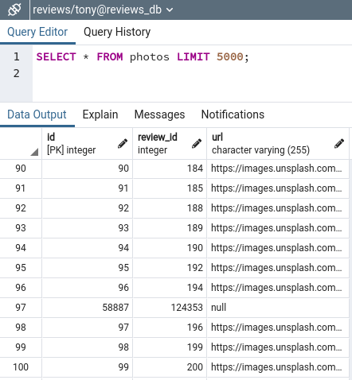

# Tony Ly’s SDC Engineering Journal and Notes
### Contacts:
* [Website/Resume](http://tonyly.com/)
* [GitHub](https://github.com/tonyjly)
* [LinkedIn](https://www.linkedin.com/in/tonyjly/)

### Project Links
* [System Design Capstone Overview](https://learn-2.galvanize.com/cohorts/2596/blocks/101/content_files/System%20Design%20Capstone/introduction-to-system-design-capstone.md)
* Phases
  * [Phase 1: Create the Database](https://learn-2.galvanize.com/cohorts/2596/blocks/101/content_files/System%20Design%20Capstone/phases/phase_1.md)
  * [Phase 2: Create the API](https://learn-2.galvanize.com/cohorts/2596/blocks/101/content_files/System%20Design%20Capstone/phases/phase_2.md)
  * [Phase 3: Performance Tune the Service](https://learn-2.galvanize.com/cohorts/2596/blocks/101/content_files/System%20Design%20Capstone/phases/phase_3.md)
  * [Phase 4: Deploy and Benchmark Initial Performance](https://learn-2.galvanize.com/cohorts/2596/blocks/101/content_files/System%20Design%20Capstone/phases/phase_4.md)
  * [Phase 5: Scale the Application](https://learn-2.galvanize.com/cohorts/2596/blocks/101/content_files/System%20Design%20Capstone/phases/phase_5.md)
  * [Phase 6: Presentations](https://learn-2.galvanize.com/cohorts/2596/blocks/101/content_files/System%20Design%20Capstone/phases/phase_6.md)

* [Github](https://github.com/TOBREGA)
* [Google Drive](https://drive.google.com/drive/folders/1jpWqFmw1oKkMOHSlKW58yRasG5LYd27_)
* [Trello Template Board](https://miro.com/app/board/o9J_lGGB1GE=/)
* [Miro Board](https://miro.com/app/board/o9J_lGGB1GE=/)

### General Links
* [Code Reviews Checklist](https://learn-2.galvanize.com/cohorts/2596/blocks/94/content_files/Front%20End%20Capstone/exercises/code_reviews.md)
* [Ticketing System](https://learn-2.galvanize.com/cohorts/2596/blocks/94/content_files/Front%20End%20Capstone/exercises/ticketing.md)
* [Git Feature Branch Workflow](https://www.atlassian.com/git/tutorials/comparing-workflows/feature-branch-workflow) (Atlassian)
* [Recommended Technologies](https://learn-2.galvanize.com/cohorts/2596/blocks/94/content_files/Front%20End%20Capstone/exercises/tech_choices.md)
* [Example Trello Project](https://trello.com/b/FcySKoaf/example-trello-project) (Julian Yuen)
* [Markdown Reference](https://commonmark.org/) (CommonMark) ([README](https://learn-2.galvanize.com/cohorts/2596/blocks/101/content_files/System%20Design%20Capstone/exercises/writing_readmes.md))
* [Markdown Tables Generator](https://tableconvert.com/) (TableConvert)
* [Guide to Javascript Date and moment.js](https://www.freecodecamp.org/news/the-ultimate-guide-to-javascript-date-and-moment-js/)
* [Gabe Acevedo IMDB](https://www.imdb.com/name/nm3629799/) (!!)
* [Fireship: Async Await](https://youtu.be/vn3tm0quoqE) (Brenton)
* [The Net Ninja](https://www.youtube.com/c/TheNetNinja/search?query=stream) (Gabe)
* [Awesome README](https://github.com/matiassingers/awesome-readme)

### Referenced Links
* [Using COPY in Postgres for Importing Large CSVs](https://www.trineo.com/blog/2018/08/using-copy-in-postgres-for-importing-large-csvs) (Brenton)
* [Import CSV data into PostgreSQL using Node.js](https://bezkoder.com/node-js-csv-postgresql/)
* [How to Be a Kickass New Software Engineer by Richard Gan](https://www.linkedin.com/pulse/how-kickass-new-software-engineer-raymond-gan/) (Eli)
* [Database Indexing with PostgreSQL](https://youtu.be/-qNSXK7s7_w) (hint from Pete)
* Dates
  * [Everything You Need to Know About Date in JavaScript](https://css-tricks.com/everything-you-need-to-know-about-date-in-javascript/) (CSS-Tricks)
  * [The Date Constructor](https://tc39.es/ecma262/#sec-date-constructor) (ECMAScript 2022)
  * [Date.parse](https://developer.mozilla.org/en-US/docs/Web/JavaScript/Reference/Global_Objects/Date/parse) (MDN)
* [Turn on query execution time](https://www.postgresqltutorial.com/psql-commands/) (Brenton, #14)
* [PostgreSQL Cheatsheet](https://gist.github.com/Kartones/dd3ff5ec5ea238d4c546) #1
* [PostgreSQL Cheatsheet](https://www.postgresqltutorial.com/postgresql-cheat-sheet/) #2
* [Express with async/await](https://node-postgres.com/guides/async-express) (Brenton)
* [`csv-parser` docs](https://www.npmjs.com/package/csv-parser)

---

### Common Commands

Spin up PostgreSQL in a Docker container:
```
sudo docker run --name postgresql-container -p 5432:5432 -e POSTGRES_PASSWORD=student -d postgres
```

### PostgreSQL Commands

Enter PSQL Terminal
```
psql -d reviews -U tony -W
```

Query
```sql
SELECT * FROM reviews;
```

Clear the screen
```
\! clear
```

### Setup

[pgAdmin4](https://www.pgadmin.org/download/pgadmin-4-apt)

---

## 5/3/2021  (W8D1, SDC Start)
Notes
* Phase 1:  Create the Database
  * Select two DBMS technologies (one RDBMS, one NoSQL DBMS)
  * Example:  [Amazon System Design Interview: Design Parking Garage](https://www.youtube.com/watch?v=NtMvNh0WFVM&ab_channel=Exponent)
* [Reviews Module API Information](https://learn-2.galvanize.com/cohorts/2596/blocks/94/content_files/Front%20End%20Capstone/project-atelier-catwalk/reviews.md)
* Best Practices
  * Strategies
    * We can write everything in Javascript, OR
    * We can have the database do heavy lifting for us
  * Josh recommends Postgres
    * npm packages for Postgres are not broken like MySQL
  * Do not use an ORM
    * slows things down
    * main reason: because we should practice SQL to learn it better
* Terms
  * “Web-Scale”
  * “Speed is a feature” -- Google
  * Database Normalization ([guru99](https://www.guru99.com/database-normalization.html))
    * generally want to normalize to 3NF
    * there’s generally a downside to normalization
  * Database Denormalization
    * trade-off, allow for more space complexity, to achieve more performant queries

#### Database Data Modeling (1st iteration)


Data Model for Product Overview (Brenton)


Data Model for Reviews (Tony)


Data Model for Product Q&A (Gabe)


---

## 5/4/2021  (W8D2; May the 4th Be With You)

Notes
* Adjustments to our data models

#### Database Data Modeling (2nd iteration)


Data Model for Product Overview (Brenton)


Data Model for Reviews (Tony)


Data Model for Product Q&A (Gabe)


#### Initial repo setup
* [Configure It Out!](https://www.notion.so/Configure-It-Out-b5917c1616b5406b95fa10e23b056624) (Brenton)
* npm [eslint-config-airbnb](https://www.npmjs.com/package/eslint-config-airbnb)
* npm [postgres.js](https://www.npmjs.com/package/postgres)
* Commands
  * `npx install-peerdeps --dev eslint-config-airbnb`
  * `npm install postgres`
  * `npm install --save-dev jest`

#### Running PostgreSQL
`sudo -u postgres psql`, or
`sudo su - postgres`, or
`psql -d reviews -U tony -W`

#### Install Docker
* [Please-Contain-Yourself](https://github.com/dylanlrrb/Please-Contain-Yourself) (Josh, Docker Lecture)

#### Handling Static data
* Received revised static data in csv format from Josh
* ETL
  * [Import CSV data to PostgreSQL using pg](https://bezkoder.com/node-js-csv-postgresql/)
  * [Using COPY in Postgres for Importing Large CSVs](https://www.trineo.com/blog/2018/08/using-copy-in-postgres-for-importing-large-csvs) (Brenton)

---

## 5/5/2021  (W8D3)

Notes
* importing csv data into postgres
* running pgAdmin4 on a Docker container ([Dave Page](https://www.youtube.com/watch?v=RUeTKUf6JV0&ab_channel=EDB))

Spinning up PostgreSQL on Docker
```
sudo docker run --name postgresql-container -p 5432:5432 -e POSTGRES_PASSWORD=student -d postgres
```

Spinning up pgAdmin4 on Docker
```
sudo docker pull dpage/pgadmin4
sudo docker run -p 80:80 \
   -e 'PGADMIN_DEFAULT_EMAIL=user@domain.com' \
   -e 'PGADMIN_DEFAULT_PASSWORD=student' \
   -d dpage/pgadmin4
```

Josh's MySQL Import (will need some adjustments for PostgreSQL)
```sql
LOAD DATA LOCAL INFILE '/Users/path/questions.csv' INTO TABLE questions FIELDS TERMINATED BY ',' OPTIONALLY ENCLOSED BY '"' LINES TERMINATED BY '\n' IGNORE 1 ROWS (id, product_id, body, @var1, asker_name, asker_email, reported, helpfulness) SET date_written=FROM_UNIXTIME(@var1/1000);
```

Result when trying to run index.js to import csv (~2.0 GB) into postgres via node
* Appears to be error out due to running out of memory
```
tony@pop-os:~/Nextcloud/HR-SEA16/sdc/tobrega-reviews$ node db/index.js

<--- Last few GCs --->

[22479:0x6062fa0]   200919 ms: Mark-sweep (reduce) 4093.9 (4101.1) -> 4092.6 (4104.2) MB, 1833.7 / 0.0 ms  (+ 0.1 ms in 347 steps since start of marking, biggest step 0.0 ms, walltime since start of marking 1977 ms) (average mu = 0.453, current mu = 0.144[22479:0x6062fa0]   202782 ms: Mark-sweep (reduce) 4093.7 (4103.7) -> 4093.5 (4104.2) MB, 1859.2 / 0.0 ms  (average mu = 0.280, current mu = 0.002) allocation failure scavenge might not succeed


<--- JS stacktrace --->

FATAL ERROR: MarkCompactCollector: young object promotion failed Allocation failed - JavaScript heap out of memory
 1: 0xa04200 node::Abort() [node]
 2: 0x94e4e9 node::FatalError(char const*, char const*) [node]
 3: 0xb7978e v8::Utils::ReportOOMFailure(v8::internal::Isolate*, char const*, bool) [node]
 4: 0xb79b07 v8::internal::V8::FatalProcessOutOfMemory(v8::internal::Isolate*, char const*, bool) [node]
 5: 0xd34395  [node]
 6: 0xd64f2e v8::internal::EvacuateNewSpaceVisitor::Visit(v8::internal::HeapObject, int) [node]
 7: 0xd70f66 v8::internal::FullEvacuator::RawEvacuatePage(v8::internal::MemoryChunk*, long*) [node]
 8: 0xd5d14f v8::internal::Evacuator::EvacuatePage(v8::internal::MemoryChunk*) [node]
 9: 0xd5d3c8 v8::internal::PageEvacuationTask::RunInParallel(v8::internal::ItemParallelJob::Task::Runner) [node]
10: 0xd4fca9 v8::internal::ItemParallelJob::Run() [node]
11: 0xd72ec0 void v8::internal::MarkCompactCollectorBase::CreateAndExecuteEvacuationTasks<v8::internal::FullEvacuator, v8::internal::MarkCompactCollector>(v8::internal::MarkCompactCollector*, v8::internal::ItemParallelJob*, v8::internal::MigrationObserver*, long) [node]
12: 0xd7375c v8::internal::MarkCompactCollector::EvacuatePagesInParallel() [node]
13: 0xd73925 v8::internal::MarkCompactCollector::Evacuate() [node]
14: 0xd85911 v8::internal::MarkCompactCollector::CollectGarbage() [node]
15: 0xd41c38 v8::internal::Heap::MarkCompact() [node]
16: 0xd43728 v8::internal::Heap::CollectGarbage(v8::internal::AllocationSpace, v8::internal::GarbageCollectionReason, v8::GCCallbackFlags) [node]
17: 0xd46b6c v8::internal::Heap::AllocateRawWithRetryOrFailSlowPath(int, v8::internal::AllocationType, v8::internal::AllocationOrigin, v8::internal::AllocationAlignment) [node]
18: 0xd1524b v8::internal::Factory::NewFillerObject(int, bool, v8::internal::AllocationType, v8::internal::AllocationOrigin) [node]
19: 0x105b23f v8::internal::Runtime_AllocateInYoungGeneration(int, unsigned long*, v8::internal::Isolate*) [node]
20: 0x1401219  [node]
Aborted (core dumped)
```

---

## 5/6/2021  (W8D4)

#### Lecture:  [Performance Testing Your Service](https://docs.google.com/presentation/d/e/2PACX-1vQ1n8x8MWz5So5J3PqTptxxG2ZTYTGuUmzbTzsKZSnL-nYBYEVQNHmuBspjX_CBZobvgHRQ0n5ExCkR/embed?start=false&loop=false&delayms=3000&slide=id.g2a3378dcb8_0_0)
* **If we have queries executing <50 ms, we set ourselves up for success down the road**
* We’re deploying our databases on a t2 micro on AWS
* A response time of 2000 ms is among the upper limit of what we would want it to be
* Josh recommends introducing Docker during testing performance or service deployment
* Most cloud-based computing platforms already have Docker built into the services
  * AWS already has their own type of containerization
* Tests
  * Performance testing
  * Stress testing
* Stress testing
  * Stress testing tools
    * Httperf, Jmeter, Artillery (all garbage)
    * K6 (**use this**)
  * Cloud Tools
    * Loader.io (more popular)
    * Flood.io
  * We don’t stress test our static endpoints (index, App, etc)
    * Because they are not representative of our site
      
  * We will stress test our API endpoints

  * Metrics to collect

| Metric | Description | Goal |
|---|---|---|
| Response time (aka latency) | How fast does your API respond? | < 2000 ms under load |
| Throughput | How many requests can you process per second (RPS/QPS/RPM) | 100 RPS on EC2 |
| Error rate | How often does a response generate an error? | < 1% under load |

* Metrics
  * New Relic (free 2 week trial) (don’t sign up until after we’re ready to do stress testing)
  * statsD + Grafana
  * ELK stack

Notes
* Rating column cannot be null → b/c it’s a boolean
* Preceding column, `body`, has comma
* Unify dates
	* Dates in `reviews` come in three formats:
      ```js
      // Unix timestamp
      1602721790544

      // Date-time-string (ISOstring)
      2021-01-17T03:01:59.883Z

      // Date
      Wed Apr 21 2021 22:39:42 GMT-0400 (Eastern Daylight Time)
      ```
  * May use `Date.parse()` and `new Date()` constructor to handle date formats
    ```js
    // unify dates to timestamps
    if (newRow.date.length > 15) {
      newRow.date = Date.parse(newRow.date)
    }
    ```
  * Now that the 3 different date formats are all unified to be unix timestamps, they will be easier to work with

* Finished tonight
  * Clean up code via `prepareReviews.js`:
    ```js
    5700000 // lines processed
    CSV file successfully processed in 95.318 seconds
    ```

  * Load the data via postgres db schema:
    ```js
    reviews=# \i /home/tony/Nextcloud/HR-SEA16/sdc/tobrega-reviews/db/schema_reviews.sql
    DROP TABLE
    CREATE TABLE
    COPY 5760707
    reviews=#
    ```

  * Viewed table via PostgreSQL query via pgAdmin4.
  * Data looks as I had expected.
  * Missing columns are handled.
  * Dates are unified to a single date format (unix timestamp).
  * Plan to follow a similar format for the other csv data sources.

  * Shoutout to Brenton for sharing this
    * Using the JS date constructor on different date formats

      


---


## 5/7/2021  (W8D5)

Notes
* K6 is one of the best local stress testing tools available
* Josh recommends not using Docker for containerization during SDC
  * Reason is we would use containerization for the purpose of horizontal scaling
  * However, most cloud platforms already have containerization solutions

Output from running `prepareCharacteristics.js`:
```js
{
 "id": {
   "number": 3339442
 },
 "productId": {
   "number": 3339442
 },
 "name": {
   "Fit": 642780,
   "Length": 642642,
   "Comfort": 770801,
   "Quality": 984999,
   "Size": 128256,
   "Width": 128222,
   "null": 41742
 }
}
CSV file successfully processed in 13.056 seconds
```

Last row, line number:  `3339442`
* Suggests that import fully loaded the entire csv into db

Last row, `id`:  `3347679`


---

## 5/8/2021  (W8D6)

`EXPLAIN ANALYZE`
* displays the execution plan and actual run time statistics, including:
  * planning time (in ms)
  * execution time (in ms)
  * total number of rows it actually returned
* notes
  * the current implementation of `EXPLAIN ANALYZE` can add profiling overhead to query execution
  * this overhead can add some time to the actual query time


Using `EXPLAIN ANALYZE` to show query statistics:


To show a certain range of rows:
```sql
SELECT * FROM photos LIMIT 10 OFFSET 90;
```


Date Breakdown (Brenton):

```js
let longDate = 'Wed Sep 02 2020 21:14:32 GMT-0700 (Pacific Daylight Time)';
let isoDate = '2021-04-03T10:33:45.476Z'
let unixTime = 1597117493485;
let times = [longDate, isoDate, unixTime].map((date) => {
  return new Date(date).toISOString();
});
console.log(JSON.stringify(times, null, 2));

// Output:
// [
//   "2020-09-03T04:14:32.000Z",
//   "2021-04-03T10:33:45.476Z",
//   "2020-08-11T03:44:53.485Z"
// ]
```

* Issue:
  * Observing an issue where a row is inserted into an unexpected location
  * Even though the data is not in this order in the data source

     


---


## 5/10/2021  (W9D1)

### Notes
- AM standup

### Changed how `prepareReviews.js` handles dates
- In the source data file, we start off with three different date formats
  - unix timestamp
  - ISO date-string
  - full date-string
- Logic changed
  1. attempt conversion of date to number (signifying a unix timestamp), then
  2. use the `new Date()` constructor on the number, and then
  3. convert date to ISO string by chaining `.toISOString()` to the date constructor
- If the date is a number, it will construct a new date
- Otherwise, it will return the original full date
- Now, all dates will be in either
  1. ISO date-string ([MDN](https://developer.mozilla.org/en-US/docs/Web/JavaScript/Reference/Global_Objects/Date/toISOString))
  2. full date-string
- Once the dates are in these formats with the date constructor, I convert it to ISO string format, which is the [recommended format that PostgreSQL accepts](https://www.postgresql.org/docs/9.1/datatype-datetime.html)
- Reference: [The Ultimate Guide to PostgreSQL Date By Examples](https://www.postgresqltutorial.com/postgresql-date/#:~:text=Introduction%20to%20the%20PostgreSQL%20DATE%20data%20type&text=The%20lowest%20and%20highest%20values,%2C%202000%2D12%2D31.) (PostgreSQL Tutorial)

### Running `prepareReviews.js`:
```
5700000 rows processed
CSV file successfully processed in 112.221 seconds
```


### Import schema

```
reviews=# \i /home/tony/Nextcloud/HR-SEA16/sdc/tobrega-reviews/db/schema.sql
DROP TABLE
psql:/home/tony/Nextcloud/HR-SEA16/sdc/tobrega-reviews/db/schema.sql:3: NOTICE:  table "reviews" does not exist, skipping
DROP TABLE
psql:/home/tony/Nextcloud/HR-SEA16/sdc/tobrega-reviews/db/schema.sql:4: NOTICE:  table "characteristics" does not exist, skipping
DROP TABLE
psql:/home/tony/Nextcloud/HR-SEA16/sdc/tobrega-reviews/db/schema.sql:5: NOTICE:  table "photos" does not exist, skipping
DROP TABLE
CREATE TABLE
CREATE TABLE
CREATE TABLE
COPY 5760707
COPY 3339442
COPY 2735823
reviews=#
```

#### Querying the database shows that our data imported successfully:


#### Querying entire `reviews` table:
* executes within 2323 ms

  


#### Querying `reviews` table, fetching first 10 rows only:
* executes within 0.279 ms

  


#### Clear the screen in psql
* The `psql` interactive terminal doesn't have a command to clear the screen
* However, we can issue a shell command using `\! [SHELL_COMMAND_HERE]`
* Source: [Today I Learned](https://til.hashrocket.com/posts/da9ade5291-clear-the-screen-in-psql)
```
\! clear
```


#### Querying `photos` still exhibits strange row insertions:




### Handling quotes in source data
* When handling source csv files which contain quotes and working with `csv-parser`, handle quotes during *parsing*

```js
readableStream
  .pipe(parse({
    quote: false,
  }))
```


### Server and DB routing
- [Express with async/await](https://node-postgres.com/guides/async-express) (Brenton)
- Using Async/Await with node-postgres ([StackOverflow](https://stackoverflow.com/questions/53910835/using-async-await-with-node-postgres))
```js
app.get('/all_users', async (req, res) => {
  try {
    const users = await queries.getAllUsers();
    console.log(users);
  } catch(e) {
    // handle errors
  }
});
```

### Issue: Query returns results in different order
* Observing an issue where queries return a result set that starts at:  `id = 79284`
* Ran same query in both pgAdmin and psql interactive terminal
* Both methods appear to return same result set

* psql interactive terminal - result set
  ```sql
  SELECT * FROM photos;
  ```
  

* pgAdmin4 - result set

  

* Source file: `reviewsPhotosCleaned.csv`
  * id's are in order, starting from `id = 1`

  

* Using `LIMIT` and `OFFSET` do not appear to change the result set:
  ```sql
  SELECT * FROM photos LIMIT 5 OFFSET 0;
  ```
  

* However, using `ORDER BY id` does return a sorted result
  * It appears that the preceding id's are actually in the table, but perhaps out-of-order
  ```sql
  SELECT * FROM photos ORDER BY id;
  ```
  

* **UPDATE** (5/11/2021): After restarting computer, the problem is no longer reproducible. Rows return in the order expected.

---

5/11/2021  (W9D2)

### node-postgres: Client vs. Pool
- How can I choose between Client or Pool for node-postgres ([Stack Overflow](https://stackoverflow.com/questions/63588714/node9374-warning-to-load-an-es-module-set-type-module))
  > Use a pool if you have or expect to have multiple concurrent requests. That is literally what it is there for: to provide a pool of re-usable open `client` instances (reduces latency whenever a `client` can be reused).

  > In that case you definitely **do not want** to call `pool.end()` when your query completes, you want to reserve that for when your application terminates because `pool.end()` disposes of all the open `client` instances. (Remember, the point is to keep up to a fixed number of `client` instances available.)


### Lecture: Scaling Your Architecture (Elder)
* Two Types of Scaling
  1. Vertical
  2. Horizonal
* Vertical Scaling
  * Allocating more resources to the application
  * "Throwing money at the problem"
* Horizonal Scaling
  * Duplicating code and running it on additional machines
  * Scaling horizonally can be powerful, but will require us to address the new challenge of having multiple servers (i.e. introduce a load balancer)

* Use `nginx` as a server for load balancing
  * We use a load balancer to distribute the load between the servers
  * Reverse proxy

  

* We will need to tackle the client side together
  * 4 load balancers in this service

  
* Post-Lecture Questions
  * At minimum, we want to get to at least 100 requests; but we want to hit the largest number possible
  * Let Josh know if we get to 10,000 requests
  * AWS has a built-in load balancer called [AWS Elastic Load Balancer]((https://aws.amazon.com/elasticloadbalancing))
    * Can't use this on SDC, but
    * ***Can certainly use Kubernetes***
      * The difficult part is the configuration
  * Can make Docker clusters with `Docker Swarm`
  * Docker can be used alongside Kubernetes
  * [Apache vs. Nginx: Practical Considerations](https://www.digitalocean.com/community/tutorials/apache-vs-nginx-practical-considerations)
    * Apache is flexible in the way it handles connections and traffic
      * Uses multi-processing modules (MPMs) that change how client requests are handled
      * Admininistrators can swap these modules out easily, allowing for flexible connection handling architecture
    * Nginx is more optimized for load balancing
      * Nginx was launched after Apache, with awareness of the challenges Apache faced with concurrency problems at scale
      * Nginx was designed from the start to use an **asynchronous, non-blocking, event-driven connection handlign algorithm**
      * Spawns worker processes
      * Can scale far with limited resources


### Configuring Express Server & Postgres

* Node.js, Express.js, and PostgreSQL: CRUD REST API example ([LogRocket](https://blog.logrocket.com/nodejs-expressjs-postgresql-crud-rest-api-example/))

* Is `body-parser` necessary? ([Medium](https://medium.com/@mmajdanski/express-body-parser-and-why-may-not-need-it-335803cd048c))
  * No longer needed, if we're using Express 4.16+
  ```js
  app.use(express.json()); // Used to parse JSON bodies
  ```
  ```js
  app.use(express.urlencoded()); // Parse URL-encoded bodies
  ```

* Pooling ([node-postgres](https://node-postgres.com/features/pooling)) ([pg.Pool](https://node-postgres.com/api/pool))
  * >Connecting a new client to the PostgreSQL server requires a handshake which can take 20-30 milliseconds.
  * >During this time passwords are negotiated, SSL may be established, and configuration information is shared with the client & server.
  * > Incurring this cost every time we want to execute a query would substantially slow down our application.
  * > The PostgreSQL server can only handle a [limited number of clients at a time](https://wiki.postgresql.org/wiki/Number_Of_Database_Connections).
    * > Pg will usually complete the same 10,000 transactions faster by doing them 5, 10 or 20 at a time than by doing them 500 at a time.
  * > PostgreSQL can only process one query at a time on a single connected client in a **first-in first-out** manner (FIFO).


### Querying
* Querying `/reviews/:product_id` where `product_id = 20100` returns a result set of an array of 5 objects within 296 ms

  


