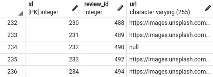
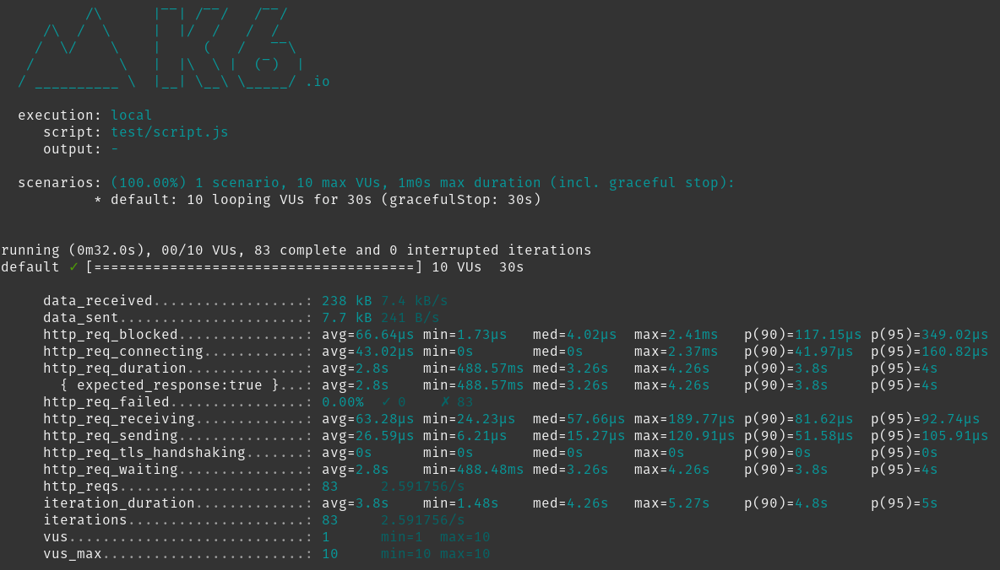

# System Design Capstone Engineering Journal
## Author: Tony Ly
### Contacts:
- [Website/Resume](http://tonyly.com/)
- [GitHub](https://github.com/tonyjly)
- [LinkedIn](https://www.linkedin.com/in/tonyjly/)


## Table of Contents
  - [Project Links](#project-links)
  - [General Links](#general-links)
  - [Referenced Links](#referenced-links)
  - [Common Commands](#common-commands)
  - [PostgreSQL Commands](#postgresql-commands)
  - [Setup](#setup)
  - [5/3/2021  (W8D1, SDC Start)](#532021--w8d1-sdc-start)
      - [Database Data Modeling (1st iteration)](#database-data-modeling-1st-iteration)
  - [5/4/2021  (W8D2; May the 4th Be With You)](#542021--w8d2-may-the-4th-be-with-you)
      - [Database Data Modeling (2nd iteration)](#database-data-modeling-2nd-iteration)
      - [Initial repo setup](#initial-repo-setup)
      - [Running PostgreSQL](#running-postgresql)
      - [Install Docker](#install-docker)
      - [Handling Static data](#handling-static-data)
  - [5/5/2021  (W8D3)](#552021--w8d3)
  - [5/6/2021  (W8D4)](#562021--w8d4)
      - [Lecture:  Performance Testing Your Service](#lecture--performance-testing-your-service)
  - [5/7/2021  (W8D5)](#572021--w8d5)
  - [5/8/2021  (W8D6)](#582021--w8d6)
  - [5/10/2021  (W9D1)](#5102021--w9d1)
    - [Notes](#notes)
    - [Changed how `prepareReviews.js` handles dates](#changed-how-preparereviewsjs-handles-dates)
    - [Running `prepareReviews.js`:](#running-preparereviewsjs)
    - [Import schema](#import-schema)
      - [Querying the database shows that our data imported successfully:](#querying-the-database-shows-that-our-data-imported-successfully)
      - [Querying entire `reviews` table:](#querying-entire-reviews-table)
      - [Querying `reviews` table, fetching first 10 rows only:](#querying-reviews-table-fetching-first-10-rows-only)
      - [Clear the screen in psql](#clear-the-screen-in-psql)
      - [Querying `photos` still exhibits strange row insertions:](#querying-photos-still-exhibits-strange-row-insertions)
    - [Handling quotes in source data](#handling-quotes-in-source-data)
    - [Server and DB routing](#server-and-db-routing)
    - [Issue: Query returns results in different order](#issue-query-returns-results-in-different-order)
    - [node-postgres: Client vs. Pool](#node-postgres-client-vs-pool)
    - [Lecture: Scaling Your Architecture (Elder)](#lecture-scaling-your-architecture-elder)
    - [Configuring Express Server & Postgres](#configuring-express-server--postgres)
    - [Querying](#querying)
  - [5/12/2021  (W9D3)](#5122021--w9d3)
    - [Server & Routes](#server--routes)
    - [Querying (cont.)](#querying-cont)
    - [AWS Deployment](#aws-deployment)
  - [5/13/2021](#5132021)
    - [Stress Testing](#stress-testing)
    - [Deployment](#deployment)
    - [Deploying Database on an EC2 Instance](#deploying-database-on-an-ec2-instance)
    - [Local Stress Testing (k6)](#local-stress-testing-k6)
    - [Query Writing](#query-writing)


---


### Project Links
- [System Design Capstone Overview](https://learn-2.galvanize.com/cohorts/2596/blocks/101/content_files/System%20Design%20Capstone/introduction-to-system-design-capstone.md)
- Phases
  - [Phase 1: Create the Database](https://learn-2.galvanize.com/cohorts/2596/blocks/101/content_files/System%20Design%20Capstone/phases/phase_1.md)
  - [Phase 2: Create the API](https://learn-2.galvanize.com/cohorts/2596/blocks/101/content_files/System%20Design%20Capstone/phases/phase_2.md)
  - [Phase 3: Performance Tune the Service](https://learn-2.galvanize.com/cohorts/2596/blocks/101/content_files/System%20Design%20Capstone/phases/phase_3.md)
  - [Phase 4: Deploy and Benchmark Initial Performance](https://learn-2.galvanize.com/cohorts/2596/blocks/101/content_files/System%20Design%20Capstone/phases/phase_4.md)
  - [Phase 5: Scale the Application](https://learn-2.galvanize.com/cohorts/2596/blocks/101/content_files/System%20Design%20Capstone/phases/phase_5.md)
  - [Phase 6: Presentations](https://learn-2.galvanize.com/cohorts/2596/blocks/101/content_files/System%20Design%20Capstone/phases/phase_6.md)
- [Github](https://github.com/TOBREGA)
- [Google Drive](https://drive.google.com/drive/folders/1jpWqFmw1oKkMOHSlKW58yRasG5LYd27_)
- [Trello Template Board](https://trello.com/b/g3UQuSMv/tobrega-project)
- [Miro Board](https://miro.com/app/board/o9J_lGGB1GE=/)

### General Links
- Galvanize Learn
  - [Code Reviews Checklist](https://learn-2.galvanize.com/cohorts/2596/blocks/94/content_files/Front%20End%20Capstone/exercises/code_reviews.md)
  - [Ticketing System](https://learn-2.galvanize.com/cohorts/2596/blocks/94/content_files/Front%20End%20Capstone/exercises/ticketing.md)
  - [Recommended Technologies](https://learn-2.galvanize.com/cohorts/2596/blocks/94/content_files/Front%20End%20Capstone/exercises/tech_choices.md)
- Workflow
  - [Git Feature Branch Workflow](https://www.atlassian.com/git/tutorials/comparing-workflows/feature-branch-workflow) (Atlassian)
  - [Example Trello Project](https://trello.com/b/FcySKoaf/example-trello-project) (Julian Yuen)
- Markdown
  - [Markdown Reference](https://commonmark.org/) (CommonMark) ([README](https://learn-2.galvanize.com/cohorts/2596/blocks/101/content_files/System%20Design%20Capstone/exercises/writing_readmes.md))
  - [Markdown Tables Generator](https://tableconvert.com/) (TableConvert)
  - [Markdown Emojis](https://github.com/StylishThemes/GitHub-Dark/wiki/Emoji)
- Other
  - [Gabe Acevedo IMDB](https://www.imdb.com/name/nm3629799/) (!!)
  - [The Net Ninja](https://www.youtube.com/c/TheNetNinja/search?query=stream) (Gabe)

### Referenced Links
- [Using COPY in Postgres for Importing Large CSVs](https://www.trineo.com/blog/2018/08/using-copy-in-postgres-for-importing-large-csvs) (Brenton)
- [Import CSV data into PostgreSQL using Node.js](https://bezkoder.com/node-js-csv-postgresql/)
- [How to Be a Kickass New Software Engineer by Richard Gan](https://www.linkedin.com/pulse/how-kickass-new-software-engineer-raymond-gan/) (Eli)
- [Database Indexing with PostgreSQL](https://youtu.be/-qNSXK7s7_w) (hint from Pete)
- [Fireship: Async Await](https://youtu.be/vn3tm0quoqE) (Brenton)
- [Awesome README](https://github.com/matiassingers/awesome-readme)
- [Guide to Javascript Date and moment.js](https://www.freecodecamp.org/news/the-ultimate-guide-to-javascript-date-and-moment-js/)
- Dates
  - [Everything You Need to Know About Date in JavaScript](https://css-tricks.com/everything-you-need-to-know-about-date-in-javascript/) (CSS-Tricks)
  - [The Date Constructor](https://tc39.es/ecma262/#sec-date-constructor) (ECMAScript 2022)
  - [Date.parse](https://developer.mozilla.org/en-US/docs/Web/JavaScript/Reference/Global_Objects/Date/parse) (MDN)
- [Turn on query execution time](https://www.postgresqltutorial.com/psql-commands/) (Brenton, #14)
- [PostgreSQL Cheatsheet](https://gist.github.com/Kartones/dd3ff5ec5ea238d4c546) #1
- [PostgreSQL Cheatsheet](https://www.postgresqltutorial.com/postgresql-cheat-sheet/) #2
- [Express with async/await](https://node-postgres.com/guides/async-express) (Brenton)
- [`csv-parser` docs](https://www.npmjs.com/package/csv-parser)
- [knex.js - Query Builder](https://github.com/knex/knex)

---

### Common Commands

Spin up PostgreSQL in a Docker container:
```
sudo docker run --name postgresql-container -p 5432:5432 -e POSTGRES_PASSWORD=student -d postgres
```

### PostgreSQL Commands

Login to PSQL Interactive Terminal (local)
```
psql -d reviews -U tony -W

OR

sudo -u postgres psql
```

Login to PSQL Interactive Terminal (remote)
```
psql -U tobrega -h localhost -d reviews
```

Query
```sql
SELECT * FROM reviews;
```

Clear the screen
```
\! clear
```

### Setup

[pgAdmin4](https://www.pgadmin.org/download/pgadmin-4-apt)

---

## 5/3/2021  (W8D1, SDC Start)
Notes
- Phase 1:  Create the Database
  - Select two DBMS technologies (one RDBMS, one NoSQL DBMS)
  - Example:  [Amazon System Design Interview: Design Parking Garage](https://www.youtube.com/watch?v=NtMvNh0WFVM&ab_channel=Exponent)
- [Reviews Module API Information](https://learn-2.galvanize.com/cohorts/2596/blocks/94/content_files/Front%20End%20Capstone/project-atelier-catwalk/reviews.md)
- Best Practices
  - Strategies
    - We can write everything in Javascript, OR
    - We can have the database do heavy lifting for us
  - Josh recommends Postgres
    - npm packages for Postgres are not broken like MySQL
  - Do not use an ORM
    - slows things down
    - main reason: because we should practice SQL to learn it better
- Terms
  - “Web-Scale”
  - “Speed is a feature” -- Google
  - Database Normalization ([guru99](https://www.guru99.com/database-normalization.html))
    - generally want to normalize to 3NF
    - there’s generally a downside to normalization
  - Database Denormalization
    - trade-off, allow for more space complexity, to achieve more performant queries

#### Database Data Modeling (1st iteration)


Data Model for Product Overview (Brenton)


Data Model for Reviews (Tony)


Data Model for Product Q&A (Gabe)


---

## 5/4/2021  (W8D2; May the 4th Be With You)

Notes
* Adjustments to our data models

#### Database Data Modeling (2nd iteration)


Data Model for Product Overview (Brenton)


Data Model for Reviews (Tony)


Data Model for Product Q&A (Gabe)


#### Initial repo setup
* [Configure It Out!](https://www.notion.so/Configure-It-Out-b5917c1616b5406b95fa10e23b056624) (Brenton)
* npm [eslint-config-airbnb](https://www.npmjs.com/package/eslint-config-airbnb)
* npm [postgres.js](https://www.npmjs.com/package/postgres)
* Commands
  * `npx install-peerdeps --dev eslint-config-airbnb`
  * `npm install postgres`
  * `npm install --save-dev jest`

#### Running PostgreSQL
`sudo -u postgres psql`, or
`sudo su - postgres`, or
`psql -d reviews -U tony -W`

#### Install Docker
* [Please-Contain-Yourself](https://github.com/dylanlrrb/Please-Contain-Yourself) (Josh, Docker Lecture)

#### Handling Static data
* Received revised static data in csv format from Josh
* ETL
  * [Import CSV data to PostgreSQL using pg](https://bezkoder.com/node-js-csv-postgresql/)
  * [Using COPY in Postgres for Importing Large CSVs](https://www.trineo.com/blog/2018/08/using-copy-in-postgres-for-importing-large-csvs) (Brenton)

---

## 5/5/2021  (W8D3)

Notes
* importing csv data into postgres
* running pgAdmin4 on a Docker container ([Dave Page](https://www.youtube.com/watch?v=RUeTKUf6JV0&ab_channel=EDB))

Spinning up PostgreSQL on Docker
```
sudo docker run --name postgresql-container -p 5432:5432 -e POSTGRES_PASSWORD=student -d postgres
```

Spinning up pgAdmin4 on Docker
```
sudo docker pull dpage/pgadmin4
sudo docker run -p 80:80 \
   -e 'PGADMIN_DEFAULT_EMAIL=user@domain.com' \
   -e 'PGADMIN_DEFAULT_PASSWORD=student' \
   -d dpage/pgadmin4
```

Josh's MySQL Import (will need some adjustments for PostgreSQL)
```sql
LOAD DATA LOCAL INFILE '/Users/path/questions.csv' INTO TABLE questions FIELDS TERMINATED BY ',' OPTIONALLY ENCLOSED BY '"' LINES TERMINATED BY '\n' IGNORE 1 ROWS (id, product_id, body, @var1, asker_name, asker_email, reported, helpfulness) SET date_written=FROM_UNIXTIME(@var1/1000);
```

Result when trying to run index.js to import csv (~2.0 GB) into postgres via node
* Appears to be error out due to running out of memory
```
tony@pop-os:~/Nextcloud/HR-SEA16/sdc/tobrega-reviews$ node db/index.js

<--- Last few GCs --->

[22479:0x6062fa0]   200919 ms: Mark-sweep (reduce) 4093.9 (4101.1) -> 4092.6 (4104.2) MB, 1833.7 / 0.0 ms  (+ 0.1 ms in 347 steps since start of marking, biggest step 0.0 ms, walltime since start of marking 1977 ms) (average mu = 0.453, current mu = 0.144[22479:0x6062fa0]   202782 ms: Mark-sweep (reduce) 4093.7 (4103.7) -> 4093.5 (4104.2) MB, 1859.2 / 0.0 ms  (average mu = 0.280, current mu = 0.002) allocation failure scavenge might not succeed


<--- JS stacktrace --->

FATAL ERROR: MarkCompactCollector: young object promotion failed Allocation failed - JavaScript heap out of memory
 1: 0xa04200 node::Abort() [node]
 2: 0x94e4e9 node::FatalError(char const*, char const*) [node]
 3: 0xb7978e v8::Utils::ReportOOMFailure(v8::internal::Isolate*, char const*, bool) [node]
 4: 0xb79b07 v8::internal::V8::FatalProcessOutOfMemory(v8::internal::Isolate*, char const*, bool) [node]
 5: 0xd34395  [node]
 6: 0xd64f2e v8::internal::EvacuateNewSpaceVisitor::Visit(v8::internal::HeapObject, int) [node]
 7: 0xd70f66 v8::internal::FullEvacuator::RawEvacuatePage(v8::internal::MemoryChunk*, long*) [node]
 8: 0xd5d14f v8::internal::Evacuator::EvacuatePage(v8::internal::MemoryChunk*) [node]
 9: 0xd5d3c8 v8::internal::PageEvacuationTask::RunInParallel(v8::internal::ItemParallelJob::Task::Runner) [node]
10: 0xd4fca9 v8::internal::ItemParallelJob::Run() [node]
11: 0xd72ec0 void v8::internal::MarkCompactCollectorBase::CreateAndExecuteEvacuationTasks<v8::internal::FullEvacuator, v8::internal::MarkCompactCollector>(v8::internal::MarkCompactCollector*, v8::internal::ItemParallelJob*, v8::internal::MigrationObserver*, long) [node]
12: 0xd7375c v8::internal::MarkCompactCollector::EvacuatePagesInParallel() [node]
13: 0xd73925 v8::internal::MarkCompactCollector::Evacuate() [node]
14: 0xd85911 v8::internal::MarkCompactCollector::CollectGarbage() [node]
15: 0xd41c38 v8::internal::Heap::MarkCompact() [node]
16: 0xd43728 v8::internal::Heap::CollectGarbage(v8::internal::AllocationSpace, v8::internal::GarbageCollectionReason, v8::GCCallbackFlags) [node]
17: 0xd46b6c v8::internal::Heap::AllocateRawWithRetryOrFailSlowPath(int, v8::internal::AllocationType, v8::internal::AllocationOrigin, v8::internal::AllocationAlignment) [node]
18: 0xd1524b v8::internal::Factory::NewFillerObject(int, bool, v8::internal::AllocationType, v8::internal::AllocationOrigin) [node]
19: 0x105b23f v8::internal::Runtime_AllocateInYoungGeneration(int, unsigned long*, v8::internal::Isolate*) [node]
20: 0x1401219  [node]
Aborted (core dumped)
```

---

## 5/6/2021  (W8D4)

#### Lecture:  [Performance Testing Your Service](https://docs.google.com/presentation/d/e/2PACX-1vQ1n8x8MWz5So5J3PqTptxxG2ZTYTGuUmzbTzsKZSnL-nYBYEVQNHmuBspjX_CBZobvgHRQ0n5ExCkR/embed?start=false&loop=false&delayms=3000&slide=id.g2a3378dcb8_0_0)
* **If we have queries executing <50 ms, we set ourselves up for success down the road**
* We’re deploying our databases on a t2 micro on AWS
* A response time of 2000 ms is among the upper limit of what we would want it to be
* Josh recommends introducing Docker during testing performance or service deployment
* Most cloud-based computing platforms already have Docker built into the services
  * AWS already has their own type of containerization
* Tests
  * Performance testing
  * Stress testing
* Stress testing
  * Stress testing tools
    * Httperf, Jmeter, Artillery (all garbage)
    * K6 (**use this**)
  * Cloud Tools
    * Loader.io (more popular)
    * Flood.io
  * We don’t stress test our static endpoints (index, App, etc)
    * Because they are not representative of our site
      
  * We will stress test our API endpoints

  * Metrics to collect

| Metric | Description | Goal |
|---|---|---|
| Response time (aka latency) | How fast does your API respond? | < 2000 ms under load |
| Throughput | How many requests can you process per second (RPS/QPS/RPM) | 100 RPS on EC2 |
| Error rate | How often does a response generate an error? | < 1% under load |

* Metrics
  * New Relic (free 2 week trial) (don’t sign up until after we’re ready to do stress testing)
  * statsD + Grafana
  * ELK stack

Notes
* Rating column cannot be null → b/c it’s a boolean
* Preceding column, `body`, has comma
* Unify dates
	* Dates in `reviews` come in three formats:
      ```js
      // Unix timestamp
      1602721790544

      // Date-time-string (ISOstring)
      2021-01-17T03:01:59.883Z

      // Date
      Wed Apr 21 2021 22:39:42 GMT-0400 (Eastern Daylight Time)
      ```
  * May use `Date.parse()` and `new Date()` constructor to handle date formats
    ```js
    // unify dates to timestamps
    if (newRow.date.length > 15) {
      newRow.date = Date.parse(newRow.date)
    }
    ```
  * Now that the 3 different date formats are all unified to be unix timestamps, they will be easier to work with

* Finished tonight
  * Clean up code via `prepareReviews.js`:
    ```js
    5700000 // lines processed
    CSV file successfully processed in 95.318 seconds
    ```

  * Load the data via postgres db schema:
    ```js
    reviews=# \i /home/tony/Nextcloud/HR-SEA16/sdc/tobrega-reviews/db/schema_reviews.sql
    DROP TABLE
    CREATE TABLE
    COPY 5760707
    reviews=#
    ```

  * Viewed table via PostgreSQL query via pgAdmin4.
  * Data looks as I had expected.
  * Missing columns are handled.
  * Dates are unified to a single date format (unix timestamp).
  * Plan to follow a similar format for the other csv data sources.

  * Shoutout to Brenton for sharing this
    * Using the JS date constructor on different date formats

      


---


## 5/7/2021  (W8D5)

Notes
* K6 is one of the best local stress testing tools available
* Josh recommends not using Docker for containerization during SDC
  * Reason is we would use containerization for the purpose of horizontal scaling
  * However, most cloud platforms already have containerization solutions

Output from running `prepareCharacteristics.js`:
```js
{
 "id": {
   "number": 3339442
 },
 "productId": {
   "number": 3339442
 },
 "name": {
   "Fit": 642780,
   "Length": 642642,
   "Comfort": 770801,
   "Quality": 984999,
   "Size": 128256,
   "Width": 128222,
   "null": 41742
 }
}
CSV file successfully processed in 13.056 seconds
```

Last row, line number:  `3339442`
* Suggests that import fully loaded the entire csv into db

Last row, `id`:  `3347679`


---

## 5/8/2021  (W8D6)

`EXPLAIN ANALYZE`
* displays the execution plan and actual run time statistics, including:
  * planning time (in ms)
  * execution time (in ms)
  * total number of rows it actually returned
* notes
  * the current implementation of `EXPLAIN ANALYZE` can add profiling overhead to query execution
  * this overhead can add some time to the actual query time


Using `EXPLAIN ANALYZE` to show query statistics:


To show a certain range of rows:
```sql
SELECT * FROM photos LIMIT 10 OFFSET 90;
```


Date Breakdown (Brenton):

```js
let longDate = 'Wed Sep 02 2020 21:14:32 GMT-0700 (Pacific Daylight Time)';
let isoDate = '2021-04-03T10:33:45.476Z'
let unixTime = 1597117493485;
let times = [longDate, isoDate, unixTime].map((date) => {
  return new Date(date).toISOString();
});
console.log(JSON.stringify(times, null, 2));

// Output:
// [
//   "2020-09-03T04:14:32.000Z",
//   "2021-04-03T10:33:45.476Z",
//   "2020-08-11T03:44:53.485Z"
// ]
```

* Issue:
  * Observing an issue where a row is inserted into an unexpected location
  * Even though the data is not in this order in the data source

     


---


## 5/10/2021  (W9D1)

### Notes
- AM standup

### Changed how `prepareReviews.js` handles dates
- In the source data file, we start off with three different date formats
  - unix timestamp
  - ISO date-string
  - full date-string
- Logic changed
  1. attempt conversion of date to number (signifying a unix timestamp), then
  2. use the `new Date()` constructor on the number, and then
  3. convert date to ISO string by chaining `.toISOString()` to the date constructor
- If the date is a number, it will construct a new date
- Otherwise, it will return the original full date
- Now, all dates will be in either
  1. ISO date-string ([MDN](https://developer.mozilla.org/en-US/docs/Web/JavaScript/Reference/Global_Objects/Date/toISOString))
  2. full date-string
- Once the dates are in these formats with the date constructor, I convert it to ISO string format, which is the [recommended format that PostgreSQL accepts](https://www.postgresql.org/docs/9.1/datatype-datetime.html)
- Reference: [The Ultimate Guide to PostgreSQL Date By Examples](https://www.postgresqltutorial.com/postgresql-date/#:~:text=Introduction%20to%20the%20PostgreSQL%20DATE%20data%20type&text=The%20lowest%20and%20highest%20values,%2C%202000%2D12%2D31.) (PostgreSQL Tutorial)

### Running `prepareReviews.js`:
```
5700000 rows processed
CSV file successfully processed in 112.221 seconds
```


### Import schema

```
reviews=# \i /home/tony/Nextcloud/HR-SEA16/sdc/tobrega-reviews/db/schema.sql
DROP TABLE
psql:/home/tony/Nextcloud/HR-SEA16/sdc/tobrega-reviews/db/schema.sql:3: NOTICE:  table "reviews" does not exist, skipping
DROP TABLE
psql:/home/tony/Nextcloud/HR-SEA16/sdc/tobrega-reviews/db/schema.sql:4: NOTICE:  table "characteristics" does not exist, skipping
DROP TABLE
psql:/home/tony/Nextcloud/HR-SEA16/sdc/tobrega-reviews/db/schema.sql:5: NOTICE:  table "photos" does not exist, skipping
DROP TABLE
CREATE TABLE
CREATE TABLE
CREATE TABLE
COPY 5760707
COPY 3339442
COPY 2735823
reviews=#
```

#### Querying the database shows that our data imported successfully:


#### Querying entire `reviews` table:
* executes within 2323 ms

  


#### Querying `reviews` table, fetching first 10 rows only:
* executes within 0.279 ms

  


#### Clear the screen in psql
* The `psql` interactive terminal doesn't have a command to clear the screen
* However, we can issue a shell command using `\! [SHELL_COMMAND_HERE]`
* Source: [Today I Learned](https://til.hashrocket.com/posts/da9ade5291-clear-the-screen-in-psql)
```
\! clear
```


#### Querying `photos` still exhibits strange row insertions:





### Handling quotes in source data
* When handling source csv files which contain quotes and working with `csv-parser`, handle quotes during *parsing*

```js
readableStream
  .pipe(parse({
    quote: false,
  }))
```


### Server and DB routing
- [Express with async/await](https://node-postgres.com/guides/async-express) (Brenton)
- Using Async/Await with node-postgres ([StackOverflow](https://stackoverflow.com/questions/53910835/using-async-await-with-node-postgres))
```js
app.get('/all_users', async (req, res) => {
  try {
    const users = await queries.getAllUsers();
    console.log(users);
  } catch(e) {
    // handle errors
  }
});
```

### Issue: Query returns results in different order
* Observing an issue where queries return a result set that starts at:  `id = 79284`
* Ran same query in both pgAdmin and psql interactive terminal
* Both methods appear to return same result set

* psql interactive terminal - result set
  ```sql
  SELECT * FROM photos;
  ```
  

* pgAdmin4 - result set

  

* Source file: `reviewsPhotosCleaned.csv`
  * id's are in order, starting from `id = 1`

  

* Using `LIMIT` and `OFFSET` do not appear to change the result set:
  ```sql
  SELECT * FROM photos LIMIT 5 OFFSET 0;
  ```
  

* However, using `ORDER BY id` does return a sorted result
  * It appears that the preceding id's are actually in the table, but perhaps out-of-order
  ```sql
  SELECT * FROM photos ORDER BY id;
  ```
  

* **UPDATE** (5/11/2021): After restarting computer, the problem is no longer reproducible. Rows return in the order expected.

---

## 5/11/2021  (W9D2)

### node-postgres: Client vs. Pool
- How can I choose between Client or Pool for node-postgres ([Stack Overflow](https://stackoverflow.com/questions/63588714/node9374-warning-to-load-an-es-module-set-type-module))
  > Use a pool if you have or expect to have multiple concurrent requests. That is literally what it is there for: to provide a pool of re-usable open `client` instances (reduces latency whenever a `client` can be reused).

  > In that case you definitely **do not want** to call `pool.end()` when your query completes, you want to reserve that for when your application terminates because `pool.end()` disposes of all the open `client` instances. (Remember, the point is to keep up to a fixed number of `client` instances available.)


### Lecture: Scaling Your Architecture (Elder)
* Two Types of Scaling
  1. Vertical
  2. Horizonal
* Vertical Scaling
  * Allocating more resources to the application
  * "Throwing money at the problem"
* Horizonal Scaling
  * Duplicating code and running it on additional machines
  * Scaling horizonally can be powerful, but will require us to address the new challenge of having multiple servers (i.e. introduce a load balancer)

* Use `nginx` as a server for load balancing
  * We use a load balancer to distribute the load between the servers
  * Reverse proxy

  

* We will need to tackle the client side together
  * 4 load balancers in this service

  
* Post-Lecture Questions
  * At minimum, we want to get to at least 100 requests; but we want to hit the largest number possible
  * Let Josh know if we get to 10,000 requests
  * AWS has a built-in load balancer called [AWS Elastic Load Balancer]((https://aws.amazon.com/elasticloadbalancing))
    * Can't use this on SDC, but
    * ***Can certainly use Kubernetes***
      * The difficult part is the configuration
  * Can make Docker clusters with `Docker Swarm`
  * Docker can be used alongside Kubernetes
  * [Apache vs. Nginx: Practical Considerations](https://www.digitalocean.com/community/tutorials/apache-vs-nginx-practical-considerations)
    * Apache is flexible in the way it handles connections and traffic
      * Uses multi-processing modules (MPMs) that change how client requests are handled
      * Admininistrators can swap these modules out easily, allowing for flexible connection handling architecture
    * Nginx is more optimized for load balancing
      * Nginx was launched after Apache, with awareness of the challenges Apache faced with concurrency problems at scale
      * Nginx was designed from the start to use an **asynchronous, non-blocking, event-driven connection handlign algorithm**
      * Spawns worker processes
      * Can scale far with limited resources


### Configuring Express Server & Postgres

* Node.js, Express.js, and PostgreSQL: CRUD REST API example ([LogRocket](https://blog.logrocket.com/nodejs-expressjs-postgresql-crud-rest-api-example/))

* Is `body-parser` necessary? ([Medium](https://medium.com/@mmajdanski/express-body-parser-and-why-may-not-need-it-335803cd048c))
  * No longer needed, if we're using Express 4.16+
  ```js
  app.use(express.json()); // Used to parse JSON bodies
  ```
  ```js
  app.use(express.urlencoded()); // Parse URL-encoded bodies
  ```

* Pooling ([node-postgres](https://node-postgres.com/features/pooling)) ([pg.Pool](https://node-postgres.com/api/pool))
  * >Connecting a new client to the PostgreSQL server requires a handshake which can take 20-30 milliseconds.
  * >During this time passwords are negotiated, SSL may be established, and configuration information is shared with the client & server.
  * > Incurring this cost every time we want to execute a query would substantially slow down our application.
  * > The PostgreSQL server can only handle a [limited number of clients at a time](https://wiki.postgresql.org/wiki/Number_Of_Database_Connections).
    * > Pg will usually complete the same 10,000 transactions faster by doing them 5, 10 or 20 at a time than by doing them 500 at a time.
  * > PostgreSQL can only process one query at a time on a single connected client in a **first-in first-out** manner (FIFO).

    ```js
    module.exports = {
      host: 'localhost',
      port: 5432,
      database: 'reviews',
      user: 'user',
      password: 'hunter2',

      // number of milliseconds to wait before timing out when connecting a new client
      // by default this is 0 which means no timeout
      connectionTimeoutMillis: 2000,

      // number of milliseconds a client must sit idle in the pool and not be checked out
      // before it is disconnected from the backend and discarded
      // default is 10000 (10 seconds) - set to 0 to disable auto-disconnection of idle clients
      idleTimeoutMillis: 30000,

      // maximum number of clients the pool should contain
      // by default this is set to 10.
      max: 20,
    }
    ```


### Querying
* [Query Nested Data in Postgres using Node.js](https://itnext.io/query-nested-data-in-postgres-using-node-js-35e985368ea4) (Brenton, Pete)
  * Postgres has some functions that allow returning complex data structures directly as “JSON”. This works great with node.js because they just become native JavaScript objects.
  * This article provides a couple ways to query nested data in Postgres:
    * "naive solution" (slower)
    * "optimized solution" (faster)
* FEC Atelier Reviews API ([Learn](https://learn-2.galvanize.com/cohorts/2596/blocks/94/content_files/Front%20End%20Capstone/project-atelier-catwalk/reviews.md))
* Querying `/reviews/:product_id` where `product_id = 20100` returns a result set of an array of 5 objects within 296 ms

  


---

## 5/12/2021  (W9D3)

* Submitted an entry to the [GitHub Graduation 2021 Yearbook](https://github.com/education/GitHubGraduation-2021)
  * First 5000 PR's get swag in the mail

* [PostgreSQL Foreign Keys](https://www.postgresql.org/docs/13/tutorial-fk.html)
  * My SQL schema currently does not contain foreign keys
    * Lacking foreign keys may introduce the risk of adding rows to tables which lack an otherwise necessary matching entry in another table (i.e. referential integrity)
    * e.g. Adding a review photo url to the table, for which a matching review does not exist
  * > You want to make sure that no one can insert rows in the weather table that do not have a matching entry in the cities table.
  * > This is called maintaining the referential integrity of your data.

### Server & Routes
  - [x] Server should have `app.use`
  - [x] Routes will have `app.get`, `app.post`, `app.put`, etc.

### Querying (cont.)
  * Two general strategies we can take to construct queries for Postgres
    1. Multiple queries, shape results in Javascript
        * expect: easier to implement, more difficult to shape, may be less performant

    2. Single query with nested data, shape results from query to Postgres ([Pete Cowles](https://itnext.io/query-nested-data-in-postgres-using-node-js-35e985368ea4))
        * expect: more difficult to implement, little/no shaping in Javascript, may be more performant
  * I plan to use the first strategy in writing multiple queries and then shaping the data in JS in the interest of *prioritizing time towards scaling the architecture*, instead of perfecting the db query
    * Perhaps this is the more valuable knowledge/experience to gain from this capstone
  * Use `async/await` and `Promise.all([])` to query db and shape data to return to the client
    *
  * Row mode ([node-postgres](https://node-postgres.com/features/queries)) (Brenton)
    * > By default node-postgres reads rows and collects them into JavaScript objects with the keys matching the column names and the values matching the corresponding row value for each column.
    * > If you do not need or do not want this behavior you can pass rowMode: 'array' to a query object.
    * > This will inform the result parser to bypass collecting rows into a JavaScript object, and instead will return each row as an array of values.
      ```js
      const query = {
        text: 'SELECT $1::text as first_name, select $2::text as last_name',
        values: ['Brian', 'Carlson'],
        rowMode: 'array',
      }
      ```

id | product_id | rating |    date    |              summary              |                                                                    body                                                                     | recommend | reported |   reviewer_name    |    reviewer_email    |             response              | helpfulness
----|------------|--------|------------|-----------------------------------|---------------------------------------------------------------------------------------------------------------------------------------------|-----------|----------|--------------------|----------------------|-----------------------------------|-------------
  1 |          1 | 5      | 2020-07-30 | _summary_           | _body_ | t         | f        | funtime            | @ | null                              |           8
  2 |          1 | 4      | 2021-01-09 | _summary_               | _body_                                                         | f         | f        | mymainstreammother | @ | null                              |           2
  3 |          2 | 4      | 2020-12-30 | _summary_          | _body_                                                                        | t         | f        | bigbrotherbenjamin | @ | _response_  |           5
  4 |          2 | 4      | 2020-07-01 | _summary_               | _body_                                                                                                         | t         | f        | fashionperson      | @ | null                              |           1
  5 |          2 | 3      | 2021-03-17 | _summary_  | _body_                                                                                                                  | t         | f        | shortandsweeet     | @ | null                              |           5
(5 rows)

* AWS Account Suspension
  * Account was suspended and subsequently terminated due to not logging in within a period of time following suspension
  * Note to self
    * Make sure to not let account become suspended
    * If suspended, make sure to login within 60 or 90 days so that it does not get terminated
    * Terminated accounts **cannot** be reactivated
    * Email accounts associated with terminated accounts may not be reused for a new account; must use a different email address
  * Made a new account using a new email address

  

### AWS Deployment
* [Lecture: Intro to AWS](https://docs.google.com/presentation/d/e/2PACX-1vSfUDpvL_x-g5FV9Su-R_1EGikA1Zy0YdUCoVSoyAYAd8EzPkmtJBkHirR0H3VBI9fcXO9vN-8W7Tye/embed?start=false&loop=false&delayms=3000)
* [AWS Management Console](https://console.aws.amazon.com/console/home)


Restrict SSH access to my personal IP only


Download `.pem` file, and launch instance


Make the `.pem` file read-only
  ```
  chmod 400 sdc_reviews.pem
  ```

SSH into the AWS EC2 t2.micro instance
```
ssh -i sdc_reviews.pem ubuntu@AWS_SERVER_IP
```

Update system
```
sudo apt-get update && sudo apt-get upgrade -y
```

Install Node.js v16
```
curl -fsSL https://deb.nodesource.com/setup_16.x | sudo -E bash -
sudo apt-get install -y nodejs
```

Reroute all traffic received at `:80` to `:3000`
```
sudo iptables -t nat -A PREROUTING -i eth0 -p tcp --dport 80 -j REDIRECT --to-port 3000
```


Created a budget, with email alert if I exceed $0.01


---

## 5/13/2021  (W9D4)

### Stress Testing
- k6.io (local testing) ([install](https://k6.io/docs/getting-started/installation/#linux)) ([run](https://k6.io/docs/getting-started/running-k6/))
- [loader.io](https://loader.io/) (cloud testing)
- [New Relic](https://newrelic.com/)

### Deployment
- Deploy db on AWS first
- The goals of SDC
  - Identify bottlenecks in our architecture
  - Reach the highest RPS as we can

### Deploying Database on an EC2 Instance
- Setting up a remote Postgres database server on Ubuntu 18.04 ([LogRocket](https://blog.logrocket.com/setting-up-a-remote-postgres-database-server-on-ubuntu-18-04/)) (Jared)
- Copying PostgreSQL database to another server ([Stack Overflow](https://stackoverflow.com/questions/1237725/copying-postgresql-database-to-another-server)) (Jared)

Login via SSH
```
ssh -i sdc_reviews.pem ubuntu@REMOTE_IP
```

Clone repo, install packages
```
git clone https://github.com/repo/repo.git

cd repo/

npm install
```

Add PostgreSQL Apt Repository & Install ([PostgreSQL](https://www.postgresql.org/download/linux/ubuntu/))

```
sudo sh -c 'echo "deb http://apt.postgresql.org/pub/repos/apt $(lsb_release -cs)-pgdg main" > /etc/apt/sources.list.d/pgdg.list'

wget --quiet -O - https://www.postgresql.org/media/keys/ACCC4CF8.asc | sudo apt-key add -

sudo apt-get update

sudo apt-get -y install postgresql
```

Configure PostgreSQL
```
sudo -u postgres psql

sudo -u postgres createuser --interactive --pwprompt
```

Prompts
```
Enter name of role to add: user
Enter password for new role:
Enter it again:
Shall the new role be a superuser? (y/n) n
Shall the new role be allowed to create databases? (y/n) y
Shall the new role be allowed to create more new roles? (y/n) y
```

Create PostgreSQL database
```
sudo -u postgres createdb -O user database
```

Allow remote access
```
nano /etc/postgresql/13/main/postgresql.conf

listen_addresses = '*'  // uncomment and change to this
```

Allow connections from
```
nano /etc/postgresql/13/main/pg_hba.conf

# IPv4 local connections:
host    all             all             0.0.0.0/0            md5
```

Open TCP Port & Restart PostgreSQL
```
sudo ufw allow 5432/tcp
sudo systemctl restart postgresql
```

### Local Stress Testing (k6)

First run, default options


10 VUs, 30s


### Query Writing

Query 1:  With the help of my colleagues, we were able to write this query
```sql
SELECT id,
        rating,
        summary,
        recommend,
        response,
        body,
        date,
        reviewer_name,
        reviewer_email,
        helpfulness,
        (
          SELECT ARRAY_TO_JSON(ARRAY_AGG(ROW_TO_JSON(p)))
          FROM (
              SELECT id,
                url
              FROM photos
              WHERE r.id = photos.review_id
            ) p
        ) AS photos,
        reported
      FROM reviews r
      WHERE product_id = $1;
```

Query 1:  Which returns this result
```js
[
  {
    "id": 115566,
    "rating": "4",
    "summary": "Velit cumque nulla itaque eos eos explicabo totam.",
    "recommend": true,
    "response": "null",
    "body": "Illum ullam enim rerum omnis reiciendis.", // value truncated
    "date": "2020-06-13T07:00:00.000Z", // double-check time format
    "reviewer_name": "Christophe33",
    "reviewer_email": "Nicolas_Hodkiewicz@hotmail.com",
    "helpfulness": 19,
    "photos": null, // should return empty array; look into COALESCE
    "reported": false
  },

  ...

]
```

This is the general shape that I want to achieve in my results. However, photos should return an array at all times. If there are no photos, I should return an empty array.

While the goal is to use the PostgreSQL Conditional Expression `COALESCE` for a more efficient and elegant method of handling `null` cases, I had difficulty implementing this in my query. ([Stack Overflow](https://stackoverflow.com/questions/27479180/using-coalesce-to-handle-null-values-in-postgresql/27485689))

In the meantime, I solved this problem in Javascript so that I can get closer to deploying the server. I plan to circle back and adjust this query. It will be interesting to note the difference in query execution time (between Javascript implementation vs. PostgreSQL `COALESCE`) and its impact on RPS.
```js
// TODO: Use COALESCE to handle when photos array === null
results.rows.map((row) => {
  if (row.photos === null) { row.photos = []; }
})
```

VUs: 10; Duration: 30s; Sleep = 1


VUs: 1000, Duration: 30s; Sleep = 0.1


